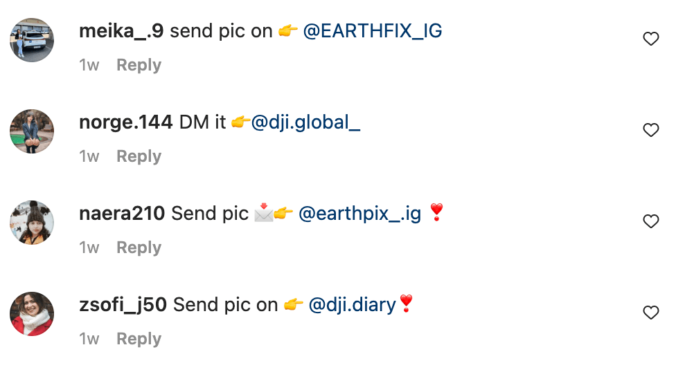
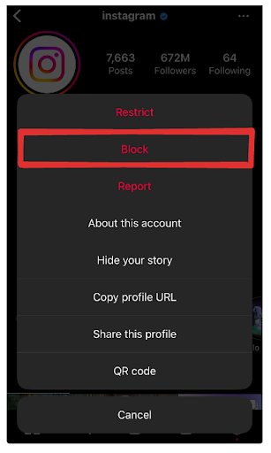

We've all seen them enticing Instagram giveaways that seem too good to be true. Like and follow for a chance to win a Rolex? Yes, please! Unfortunately, in our world of constant information and AI deepfakes, it's getting harder to distinguish the real from the fake. And, if you do fall victim to a scam, the consequences can be catastrophic. But don't worry - we're here to help.

In this article, we'll guide you through the red flags and help you spot and report the most common fake giveaways on Instagram. 

## Key Takeaways
- The verification status of a brand's account serves as an important marker of credibility. If an account posting a giveaway isn't verified, it’s probably not legit.
- New accounts with few followers or recent activity that are hosting large giveaways are typically red flags. 
- Pay close attention to the quality of the giveaway post. Spelling mistakes, poor translations, and the use of stock or stolen images are huge red flags. 
- A legitimate giveaway should have clear, manageable requirements. If the requirements are overly complicated, or if there is a push for additional actions to gain extra entries, then it’s likely a scam. 
- Be wary if the giveaway isn’t transparent about its terms and conditions.
- If you spot a fake giveaway on Instagram, do your civic duty by reporting, blocking, and refraining from providing any personal information to such accounts.
- If you want to run a legit Instagram giveaway on WordPress, the best tool by far is [Raffle Leader](https://raffleleader.com).

## Common Signs Of Fake Instagram Giveaways

Most fake Instagram giveaways will have one or multiple of these common signs:

### The Giveaway Account Is a Famous Brand Name, But It's Not Verified

There are instances where a famous brand name is involved, but the account isn’t verified. Instagram verifies accounts of public figures or notable brands to avoid confusion. If a supposed brand account running a giveaway isn't verified, that's a big red flag.

### The Giveaway Account Has Only Just Been Created

Fresh accounts that are hosting massive giveaways should also raise your eyebrows. Scammers often create new accounts to avoid being tracked by Instagram or those they've defrauded.

### The Giveaway Account Doesn't Have Any Followers or Recent Activity

Scammers often run dozens or hundreds of accounts at a time, so they don’t put much effort into building any one account, resulting in a low follower count and low activity. 

### There Are Spelling Mistakes or Translation Errors in the Giveaway Post

Legitimate companies typically review their posts several times before publishing, and scammers are often not native English speakers, so spelling errors and poor translations are signs of a scam. 

### The Giveaway Post Uses Stock Images or Stolen Images

We've noted occurrences where stock images or stolen images are used in the fake giveaway posts. It's essential to watch out for this, as well-respected brands would use their own, high-quality images.

### The Giveaway Seems Too Good To Be True

I’m sorry, that faceless Instagram page with 200 followers is not actually giving away a Lamborghini. If the giveaway seems too good to be true, then it probably is. 

### The Giveaway Asks You to Complete Too Many Tasks

If the giveaway requirements are overly complicated or reek of desperation, it is most likely a scam. Likewise, if the giveaway wants you to submit personal information like your address or bank account information, it is definitely a scam. 

### The Giveaway Sets a Minimum Number of Followers

Be wary of scams that set an unrealistic minimum follower count to participate. Remember, everyone deserves a fair chance to win!

### There Are No Terms and Conditions

A lack of terms and conditions makes it too easy for scam artists to wiggle out of their “promises”. Any giveaway worth its salt will have clear rules and regulations.

### There’s No Certificate of The Prize Draw

All legal sweepstakes and giveaways need proof like a certificate for the prize draw. If missing, it’s likely a scam.

### The Organizer Doesn't Answer Your Messages

When questions go unanswered, it's a bad sign. It indicates either neglect or stealth, neither of which are things that you want to see from a giveaway promoter. 

### The Giveaway Post Uses Lots of Random Hashtags

Hashtags serve a purpose, but when the giveaway uses them randomly and excessively, it is likely attempting to reach a wider audience of potential victims.

### There Are Bots in The Comments

If you see comments like these, it’s your sign to get far, far away.

### The Giveaway Isn’t Mentioned on The Brand’s Website or Other Social Media

It’s very unlikely that a brand would host an Instagram giveaway and not mention it on any of its other websites or social media pages. 

At the end of the day, the key to avoiding scams is to trust your instincts. If a giveaway seems too good to be true, it probably is, and if an Instagram page seems fishy, it probably is. There will be tons of opportunities to enter Instagram giveaways. The pickier you are with the ones you enter, the more secure your personal information will be.

## How To Report And Block Fake Instagram Giveaways

Now that you know the common signs of fake Instagram giveaways, it's time to learn how to take action against these scammers. It is only through reporting, blocking, and safeguarding our data that we can keep Instagram safe for everyone. 

### Check the Details

Often, the devil's in the details. Scrutinize the problematic giveaway post, the account running it, and its associated content. Make note of specifics such as the username and any suspicious behaviors that drew your attention to them in the first place. Gather as much information as you can, as this will prove invaluable when formally reporting the account to Instagram.

### Send The Report

Once you've gathered sufficient evidence, it's time to report the offending account. To do so:

Visit the suspicious account or post.

Tap the three horizontal dots "..." located at the top right corner.

Choose "Report".

Follow the prompts, providing Instagram with the necessary information about the nature of the scam.

### Block

Taking action doesn't stop at reporting. It's vital to block the offending account to prevent any further communication or unsolicited activity from them. By blocking them, we not only protect ourselves but also limit their reach to other unsuspecting Instagram users.

Luckily, blocking on Instagram is super simple.

First, go to the profile of the account you wish to block.

Next, tap the three horizontal dots "..." located at the top right corner.

Lastly, select "Block". Confirm your decision if prompted.

## Be Data Safe

In a world where data is highly coveted and mishandling of personal information prevalent, it's important to exercise caution and be data safe. Avoid providing personal information or clicking on suspicious links related to these giveaways. If in doubt, always err on the side of caution. Remember, if something appears too good to be true, it usually is.

By staying vigilant and proactive, we can help keep the Instagram community safe from these fraudulent activities.